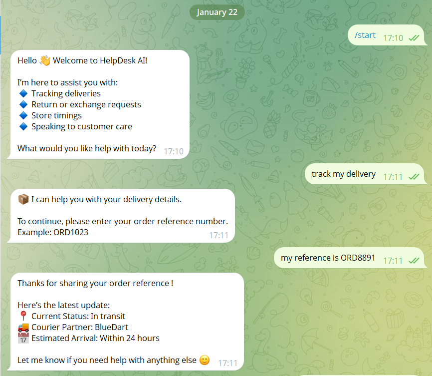

# 🤖 Customer Support Chatbot 

## Project Overview
This project focuses on building a **Customer Support Chatbot** using **Google Dialogflow ES** and integrating it with **Telegram**. The chatbot is capable of understanding user queries using **Natural Language Processing (NLP)** and responding to common customer support questions automatically. It is designed to handle FAQs such as order-related queries, delivery status, return/exchange assistance, and support timings. It provides instant responses and improves user experience by offering 24/7 automated assistance.

---

## Objectives
- Build an intent-based chatbot using Dialogflow  
- Design structured and meaningful conversational flows  
- Integrate Dialogflow with Telegram using BotFather  
- Test the chatbot inside Dialogflow and Telegram  
- Maintain a reusable and professional project structure  

---

## Features
- Intent-based NLP conversation handling  
- Default welcome and fallback responses  
- Telegram bot integration  
- Real-time user interaction  
- Modular and reusable Dialogflow agent  

---

## Tech Stack
- **Dialogflow ES** – NLP and intent processing  
- **Telegram Bot API** – Messaging platform  
- **JSON** – Intents, entities, and agent configuration  
- **GitHub** – Version control  

---

## How It Works
1. The user sends a message via Telegram  
2. Telegram forwards the message to Dialogflow  
3. Dialogflow processes the input using NLP  
4. The most relevant intent is matched  
5. A predefined response is sent back to the user  

---

## Setup & Execution

### Dialogflow Setup
- Create a Dialogflow ES agent  
- Configure intents, entities, and responses  
- Enable Telegram integration in Dialogflow  

### Telegram Integration
- Create a bot using **BotFather**  
- Generate a Telegram bot token  
- Paste the token into Dialogflow’s Telegram integration  

### Testing
- Test intents using Dialogflow’s built-in simulator  
- Interact with the bot directly on Telegram  
- Validate fallback and response accuracy  

---

## Testing & Validation
- Intent matching verified using Dialogflow simulator  
- End-to-end testing performed using Telegram  
- Fallback responses tested for unknown queries  

---

## Reusability
- The chatbot can be reused anytime without redeployment  
- The Dialogflow agent can be imported into any Dialogflow account  
- New intents and entities can be added easily  

---

## Screenshots
Screenshots included in this project:
-  
- 
-  

---

## Key Learnings
- Practical application of NLP in chatbots  
- Designing conversational flows  
- Dialogflow intent and entity management  
- Telegram bot deployment  

